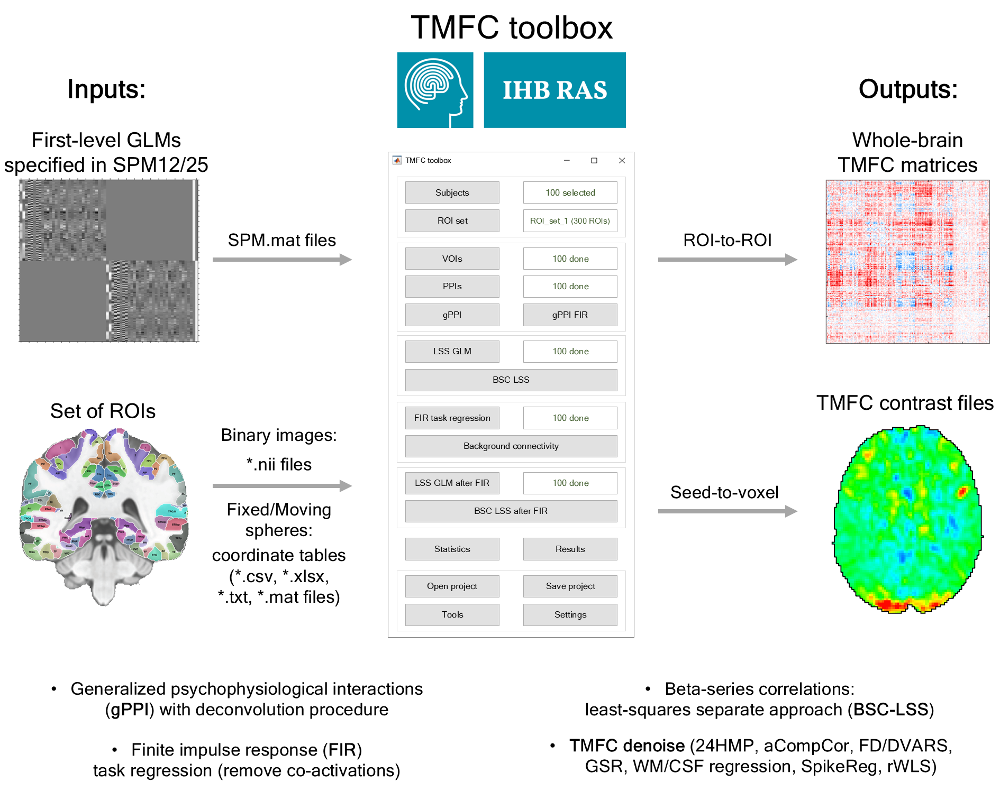
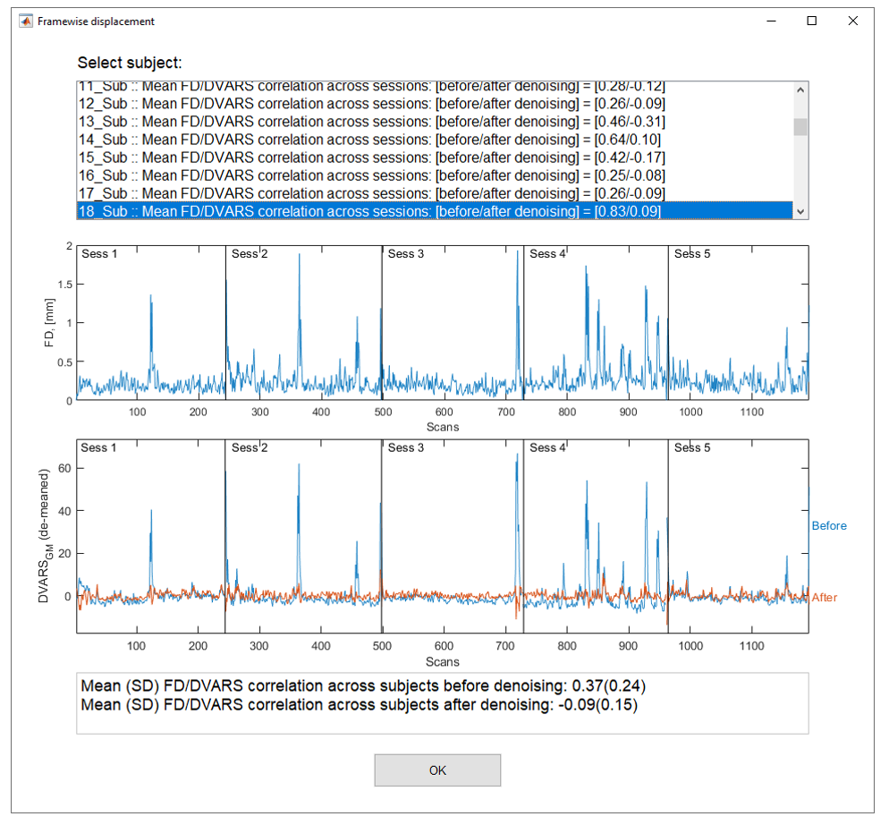

# Task-Modulated Functional Connectivity (TMFC) toolbox

[](https://doi.org/10.5281/zenodo.17177018)



-------------------------------------------------------------------------------------------

**TMFC** is a MATLAB toolbox for SPM12/SPM25 for task-modulated functional connectivity analysis.

TMFC toolbox implements:
 - Beta-series correlations based on the least-squares separate approach (**BSC-LSS**);
 - Generalized psychophysiological interactions (**gPPI**) with deconvolution procedure;
 - **Seed-to-voxel** analysis and **ROI-to-ROI** analysis (to create FC matrices);
 - Finite impulse response (**FIR**) task regression to remove co-activations;
 - **TMFC denoise**: toolbox to perform denoising for further TMFC analysis. Calculates 12HMP/24HMP, FD/DVARS, aCompCorr, GSR, WM/CSF regression, spike regression and robust WLS.
 - Graphical user interface (**GUI**) and command line interface (**CLI**);
 - RAM control (allows to estimate model parameters in the whole-brain at a time without dividing into chunks);
 - Parallel computations.

If you use TMFC toolbox, please cite this study: <br/>
[Masharipov et al. "Comparison of whole-brain task-modulated functional connectivity methods for fMRI task connectomics." Commun Biol 7, 1402 (2024)](https://doi.org/10.1038/s42003-024-07088-3).

## Installation

The current version of the toolbox is fully functional on MATLAB R2014a and later releases.

1) Add SPM12/SPM25 to your MATLAB path (if not already done);
2) Add TMFC toolbox to your MATLAB path (Home --> Set path --> Add with Subfolders --> Select TMFC_toolbox folder);
3) Enter **TMFC** in command window to open TMFC GUI <br/>
   or <br/>
4) See [TMFC_command_window_example.m](examples/TMFC_command_window_example.m) to run TMFC functions via command line.

## Prepare your data

TMFC toolbox uses information from SPM.mat files to obtain paths to fMRI files.

**If you estimated first-level GLMs and then moved the GLM and fMRI data folders to another location, you need to change paths in SPM.mat files.**

Click **Tools** button:

<p align="center">

</p>

Next, click **Change paths** button and select subjects for which you want to update the SPM.mat files. Enter the old path pattern (see **SPM.swd** field in the SPM.mat file) and the new path pattern:

<p align="center">

</p>

Click OK.

## TMFC denoise

To perform denoising for TMFC analysis, click **Tools** button and then click **Denoise**. 

Select subjects for which you want to update the SPM.mat files. 

Select **denoising parameters**:

<p align="center">

</p>

Inspect FD-DVARS correlation after denoising:

<p align="center">

</p>

TMFC denoise will add denoising regressors to the selected models. SPM.mat files for updated models will be stored in **TMFC_denoise subfolders**.

The updated models with noise regressors can be used for further TMFC analysis (select the updated SPM.mat files during **Subject selection**).

For detailed documentation, please see: https://tmfc-denoise.readthedocs.io

## Example data

To illustrate the use of TMFC toolbox, we provide simulated BOLD time series. Simulation was performed for 100 subjects and 100 ROIs. <br/>
Task design parameters:
- Event-related
- Two conditions (TaskA and TaskB)
- 40 events per condition
- Event duration = 1 s
- Random interstimulus interval (ISI) = 4-8 s (mean ISI = 6 s)
- Repetition time (TR) = 2 s
- Dummy scans: first 3 time points (6 s)
- Total scan time = 9.7 min

Simulation procedure is described in detail in [the referenced paper](https://doi.org/10.1038/s42003-024-07088-3) and here: <br/>
[https://github.com/IHB-IBR-department/TMFC_simulations](https://github.com/IHB-IBR-department/TMFC_simulations)

To prepare example data and estimate basic GLMs run this code:
```matlab

% BEFORE RUNNING THIS SCRIPT:
% 1) Set path to SPM12/SPM25
% 2) Set path to TMFC_toolbox (Add with subfolders)
% 3) Change current working directory to: '...\TMFC_toolbox\examples'

%% Prepare example data and calculate basic first-level GLMs
clear
data.SF  = 1;         % Scaling Factor (SF) for co-activations: SF = SD_oscill/SD_coact
data.SNR = 1;         % Signal-to-noise ratio (SNR): SNR = SD_signal/SD_noise
data.STP_delay = 0.2; % Short-term synaptic plasticity (STP) delay, [s]
data.N = 20;          % Sample size (Select 20 subjects out of 100 to reduce computations)
data.N_ROIs = 100;    % Number of ROIs
data.dummy = 3;       % Remove first M dummy scans
data.TR = 2;          % Repetition time (TR), [s]
data.model = 'AR(1)'; % Autocorrelation modeling

% Set path for stat folder 
spm_jobman('initcfg');
data.stat_path = spm_select(1,'dir','Select a folder for data extraction and statistical analysis');

% Set path for simulated BOLD time series *.mat file
data.sim_path = fullfile(pwd,'data','SIMULATED_BOLD_EVENT_RELATED_[2s_TR]_[1s_DUR]_[6s_ISI]_[40_TRIALS].mat');

% Set path for task design *.mat file (stimulus onset times, SOTs)
data.sots_path = fullfile(pwd,'data','TASK_DESIGN_EVENT_RELATED_[2s_TR]_[1s_DUR]_[6s_ISI]_[40_TRIALS].mat');

% Generate *.nii images and estimate GLMs
parallel = 1;         % Parallel (1) or serial (0)
tmfc_prepare_example_data(data,parallel)

% Change current directory to new TMFC project folder
cd(data.stat_path)

```

This code creates *.nii files for 20 subjects (we select 20 subjects out of 100 and consider high SNR = 1 to reduce the number of computations).

Each *.nii file represents a single time point and consists of 100 voxels. Each voxel corresponds to one ROI. In this case, seed-to-voxel and ROI-to-ROI analyses are equivalent.

In real datasets, the number of voxels is not equal to the number of ROIs. However, all steps of TMFC analysis will be the same as described below.

## Example of TMFC GUI usage

## Main TMFC window

Enter **TMFC** in command window to open TMFC GUI:

<p align="center">

</p>

## Settings

Click **Settings** button to open settings window:

<p align="center">

</p>

* Choose between sequential and parallel computing (default: sequential computing)(change to parallel computing to speed up computations);
* Choose to store temporary files for GLM estimation on disk or in RAM (default: in RAM);
* Define Max RAM for GLM estimation (default: 2^32 = 4 GB)(change to 2^33 or 2^34 to speed up computations);
* Choose to perform seed-to-voxel and/or ROI-to-ROI analysis (default: both).

Click OK.

## Overview of TMFC functions 

<p align="center">

</p>

See how to use TMFC functions via command line [here](#Example-of-TMFC-usage-from-command-line).

## Folder structure

TMFC toolbox has the following folder structure:

<p align="center">

</p>

These folders and files will be created in the selected project path after performing corresponding analyses. To select TMFC project path and subjects click **Subjects** button.

## Select subjects

Click **Subjects** button to open subject manager window:

<p align="center">

</p>

Click **Select subjects folder** button and select folders for 20 subjects (inside "...\Example_data_SF_[1.00] SNR_[1.00] STP_[0.20]_AR(1)\GLMs" folder):

<p align="center">

</p>

Click **Select SPM.mat file for Subject #1** and select SPM.mat for the first subject ("...\GLMs\Subject_001\SPM.mat"), which contains information about the basic first-level GLM (typical GLM used for activation analysis):

<p align="center">

</p>

Check selected subjects and click OK:

<p align="center">

</p>

Finally, **select a folder for the new TMFC project**.

## Select ROIs

Click **ROI_set** button and define ROI set name:

<p align="center">

</p>

Click OK and choose "Select ROI binary images":

<p align="center">

</p>

Select 100 ROI masks (inside "...\Example_data_SF_[1.00] SNR_[1.00] STP_[0.20]_AR(1)\ROI_masks" folder):

<p align="center">

</p>

Check selected ROIs and click OK:

<p align="center">

</p>

In this example, single voxel represents a single ROI (i.e., ROI size = 1 voxel). In real data, each ROI will consist of several voxels. 
TMFC toolbox creates a **"TMFC_project_folder\ROI_sets\ROI_set_name\Masked_ROIs"** folder, which contains:
* Group_mean.nii file - Group mean binary mask (identifies voxels that have data across all subjects)
* ROI_name_masked.nii files - ROI mask files masked by Group_mean.nii file (reduce original ROI mask to voxels that have data across all subjects)

ROI masks which do not contain any voxels that have data across all subjects will be removed from the TMFC analysis.
User can also remove heavily cropped ROIs.

You can define several ROI sets and switch between them. For example, push **ROI_set** button a second time and then push "Add new ROI set":

<p align="center">

</p>

Define a name for the second ROI set (e.g., "20_ROIs), choose "Select ROI binary images" and select ROI masks for the second ROI set (e.g., select 20 ROIs). Now you can switch between ROI sets.

Click **ROI_set** button a third time and select "100_ROIs" set:

<p align="center">

</p>

## Least-squares separate (LSS) regression 

To perform beta-series correlation (BSC) analysis, we first need to calculate parameter estimates (betas) for individual trials using LSS regression.

Click **LSS GLM** button and select conditions of interest (individual betas will be calculated only for the selected conditions):

<p align="center">

</p>

Once the calculations are complete, TMFC toolbox will create a **"...\TMFC_project_name\LSS_regression"** folder with subfolders for each subject. Subjects' subfolders will contain **trial-wise beta images** and **SPM batches for individual trial GLMs**. 

## Beta-series correlation based on LSS regression (BSC-LSS)

To perform BSC-LSS analysis for selected ROI set, click **BSC LSS** button.

Once the calculations are complete, TMFC toolbox will create a **"...\TMFC_project_name\ROI_sets\ROI_set_name\BSC_LSS"** folder with three subfolders:
* **Beta_series** - contains beta series extracted for the selected ROI set (beta parameters are averaged across voxels for each ROI mask);
* **ROI_to_ROI**  - contains **BSC-LSS functional connectivity matrices** (Pearson’s r converted to Fisher's Z);
* **Seed_to_voxel** - contains **voxel-by-voxel BSC-LSS images** (*.nii files containing Fisher's Z values) calculated for each seed ROI.

**NOTE:** You don't need to recalculate LSS regression to perform the BSC-LSS analysis for a different ROI set. Just select a different ROI set by clicking the **ROI set** button and then click the **BSC-LSS** button.

## BSC-LSS results

By default, TMFC calculates contrasts for each condition of interest (Condition > Baseline). To calculate the functional connectivity difference between conditions (i.e., "Condition A > Condition B") click the **BSC LSS** button once again:

<p align="center">

</p>

Define a new contrast by pressing "Add new" button, enter contrast title ("TaskA_vs_TaskB") and specify contrast weights ([1 -1]), and click OK:

<p align="center">

</p>

Click OK to calculate the new contrast. Each time you need to calculate a new contrast, click the **BSC LSS** button. Contrast files will be stored in **ROI_to_ROI** and **Seed_to_voxel** subfolders.

### Seed-to-voxel results

You can use the SPM12/SPM25 software to perform voxel-wise statistical inference. Click "Specify 2nd-level" button, select "One-sample t-test" and specify 20 contrast files for the "Cond_A_vs_Cond_B" contrast and the selected seed ROI from the **...\Seed_to_voxel\ROI_name** subfolder.

### ROI-to-ROI results

Click **Results** button. Select "TaskA_vs_TaskB" contrasts for 20 subjects. Enter contrast value = 1.
Specify alpha value = 0.0005 (i.e. 0.001/2, two-sided). Select FDR (parametric) threshold and click **Run** button: 

<p align="center">

</p>

The results window will appear:

<p align="center">

</p>

You can save the results by clicking **Save data** button and re-open them later by clicking **Results** in the main TMFC window.

Non-parametric statistics, Network-based statistics (NBS) and threshold-free cluster enhancement (TFCE) with network-level FWE correction will be available in future releases.
TMFC matrices (*.mat files) can be analysed in any MATLAB toolbox for ROI-to-ROI statistical inference. For example, you can use the network-based statistics (NBS) toolbox (https://www.nitrc.org/projects/nbs/). 

To visualize the ROI-to-ROI results, you can also enter this code in MATLAB command window:

```matlab
% Select TMFC project path
tmfc.project_path = spm_select(1,'dir','Select TMFC project folder');
ROI_set_number = 1;
tmfc.ROI_set(ROI_set_number).set_name = '100_ROIs';

% Load BSC-LSS matrices for the 'TaskA_vs_TaskB' contrast (contrast # 3)
M(data.N).paths = [];
for iSub = 1:data.N
    file = fullfile(tmfc.project_path,'ROI_sets',tmfc.ROI_set(ROI_set_number).set_name,'BSC_LSS','ROI_to_ROI', ...
                    [tmfc.subjects(iSub).name '_Contrast_0003_[TaskA_vs_TaskB].mat']);
    S  = load(file); fn = fieldnames(S); M(iSub).paths = S.(fn{1});
end
clear S fn file
matrices = cat(3, M(:).paths);

% Perform one-sample t-test (two-sided, FDR-correction) 
contrast = 1;                       % A > B effect
alpha = 0.001/2;                    % alpha = 0.001 threshold corrected for two-sided comparison
correction = 'FDR';                 % False Discovery Rate (FDR) correction (Benjamini–Hochberg procedure)
[thresholded_1,pval,tval,conval_1] = tmfc_ttest(matrices,contrast,alpha,correction); 
contrast = -1;                      % B > A effect
[thresholded_2] = tmfc_ttest(matrices,contrast,alpha,correction); 

% Plot BSC-LSS results
f1 = figure(1); f1.Position = [382,422,1063,299];
try
    sgtitle('BSC-LSS results');
catch
    suptitle('BSC-LSS results');
end
subplot(1,3,1); imagesc(conval_1);        title('Group mean'); axis square; colorbar; caxis(tmfc_axis(conval_1,1));
subplot(1,3,2); imagesc(thresholded_1);   title('A>B (pFDR<0.001)'); axis square; colorbar;
subplot(1,3,3); imagesc(thresholded_2);   title('B>A (pFDR<0.001)'); axis square; colorbar;
colormap(subplot(1,3,2),'parula')
colormap(subplot(1,3,3),'parula')
colormap(subplot(1,3,1),'redblue')
set(findall(gcf,'-property','FontSize'),'FontSize',16)

```

Results for edge-wise inference with FDR-correction ("TaskA vs TaskB"):

<p align="center">

</p>

## BSC-LSS after FIR task regression

Co-activations can spuriously inflate TMFC estimates (see [the referenced paper](https://doi.org/10.1038/s42003-024-07088-3) and [Cole et al., 2019](https://doi.org/10.1016/j.neuroimage.2018.12.054)).

To remove co-activations, we can perform task regression with finite impulse response (FIR) functions prior to BSC analysis.

Click **"FIR task regression"** button and specify FIR window length and the number of FIR time bins:

<p align="center">

</p>

Click OK. Once the calculations are complete, TMFC toolbox will create a **"...\TMFC_project_name\FIR_regression"** folder with subjects' subfolders. Subjects' subfolders will contain **residuals (*.nii images)**, as well as **SPM batches and SPM.mat files for FIR GLMs**. 

To perform BSC-LSS analysis after FIR task regression (using residual time series), click **BSC LSS after FIR** button. The following steps are similar to those for the BSC-LSS analysis.

## Generalized psychophysiological interactions (gPPI)

To perform gPPI analysis, we first need to extract time series from the seed ROIs and calculate psychophysiological interaction (PPI) terms.

### Volume of interest (VOI) 

Click **"VOIs"** button to extract time series for the selected ROI set. Select conditions of interest. All other conditions will be considered as nuisance conditions. TMFC toolbox uses SPM volume of interest (VOI) function to extract time series. It extracts the first eigenvariate for the seed ROI after removing effects of no interest (using nuisance regressors, such as motion regressors, aCompCorr regressors, regressors for conditions of no interest, etc), and performing whitening and high-pass filtering.

Once the calculations are complete, TMFC toolbox will create a **"...\TMFC_project_name\ROI_sets\ROI_set_name\VOIs"** folder with subjects' subfolders. Subjects' subfolders will contain SPM **VOI .mat files**.

### Psychophysiological interaction (PPI) terms

Click **"PPIs"** button to calculate PPI terms using the deconvolution procedure ([Gitelman et al., 2003](https://doi.org/10.1016/S1053-8119(03)00058-2)). TMFC toolbox uses SPM Parametric Empirical Bayes (PEB) function to calculate PPI terms.
Select two options:
1) "Enable/Disable mean centering" ([Di, Reynolds & Biswal, 2017](https://doi.org/10.1002/hbm.23413),[Masharipov et al., 2025](https://doi.org/10.1038/s42003-024-07088-3)).
2) "Enable/Disable whitening inversion" ([He et al., 2025](https://doi.org/10.1101/2025.05.22.655642)).

   
Once the calculations are complete, TMFC toolbox will create a **"...\TMFC_project_name\ROI_sets\ROI_set_name\PPIs"** folder with subjects' subfolders. Subjects' subfolders will contain SPM **PPI .mat files**.

### gPPI analysis

Click **"gPPI"** button to perform gPPI analysis. 

Once the calculations are complete, TMFC toolbox will create a **"...\TMFC_project_name\ROI_sets\ROI_set_name\gPPI"** folder with three subfolders:
* **GLM_batches** - contains SPM batches for gPPI GLMs;
* **ROI_to_ROI**  - contains **gPPI functional connectivity matrices** (asymmetrical and symmetrical, symmetrization is carried out by averaging the upper and lower diagonal elements);
* **Seed_to_voxel** - contains **voxel-by-voxel gPPI images** calculated for each seed ROI.

## gPPI-FIR analysis

To remove co-activations with arbitrary shape of HRF function, we can combine FIR task regression with gPPI regression. The difference between classic gPPI GLM and gPPI-FIR GLM is that the
latter uses finite impulse response (FIR) functions (instead of canonical HRF function) to model activations for conditions of interest and conditions of no interest. The FIR model allows to model activations with arbitrary hemodynamic response shapes.

Click **"gPPI-FIR"** button to perform gPPI-FIR analysis. 

Once the calculations are complete, TMFC toolbox will create a **"...\TMFC_project_name\ROI_sets\ROI_set_name\gPPI-FIR"** folder with three subfolders (GLM_batches, ROI_to_ROI, Seed_to_voxel).

### gPPI-FIR results

To visualize the ROI-to-ROI results, enter this code in MATLAB command window:
```matlab
% Select TMFC project path
tmfc.project_path = spm_select(1,'dir','Select TMFC project folder');
ROI_set_number = 1;
tmfc.ROI_set(ROI_set_number).set_name = '100_ROIs';

% Load gPPI-FIR matrices for the 'TaskA_vs_TaskB' contrast (contrast # 3)
clear conval_1 thresholded_1
M(data.N).paths = [];
for iSub = 1:data.N
    file = fullfile(tmfc.project_path,'ROI_sets',tmfc.ROI_set(ROI_set_number).set_name,'gPPI_FIR','ROI_to_ROI','symmetrical', ...
                    [tmfc.subjects(iSub).name '_Contrast_0003_[TaskA_vs_TaskB].mat']);
    S  = load(file); fn = fieldnames(S); M(iSub).paths = S.(fn{1});
end
clear S fn file
matrices = cat(3, M(:).paths);

% Perform one-sample t-test (two-sided, FDR-correction) 
contrast = 1;                       % A > B effect
[thresholded_1,pval,tval,conval_1] = tmfc_ttest(matrices,contrast,alpha,correction);
contrast = -1;                      % B > A effect
[thresholded_2] = tmfc_ttest(matrices,contrast,alpha,correction); 

% Plot gPPI-FIR results
f2 = figure(2); f2.Position = [382,422,1063,299];
try
    sgtitle('gPPI-FIR results');
catch
    suptitle('gPPI-FIR results');
end
subplot(1,3,1); imagesc(conval_1);        title('Group mean'); axis square; colorbar; caxis(tmfc_axis(conval_1,1));
subplot(1,3,2); imagesc(thresholded_1);   title('A>B (pFDR<0.001)'); axis square; colorbar;
subplot(1,3,3); imagesc(thresholded_2);   title('B>A (pFDR<0.001)'); axis square; colorbar;
colormap(subplot(1,3,2),'parula')
colormap(subplot(1,3,3),'parula')
colormap(subplot(1,3,1),'redblue')
set(findall(gcf,'-property','FontSize'),'FontSize',16)

```

Results for edge-wise inference with FDR-correction ("TaskA vs TaskB"):

<p align="center">

</p>

## Example of TMFC usage from command line

Please see: <br/>
[TMFC_command_window_example.m](examples/TMFC_command_window_example.m) 


